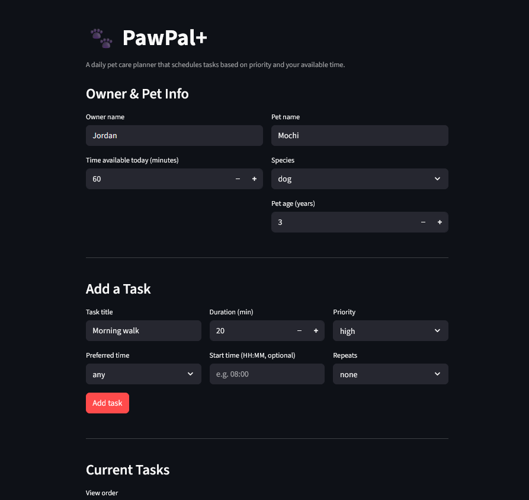
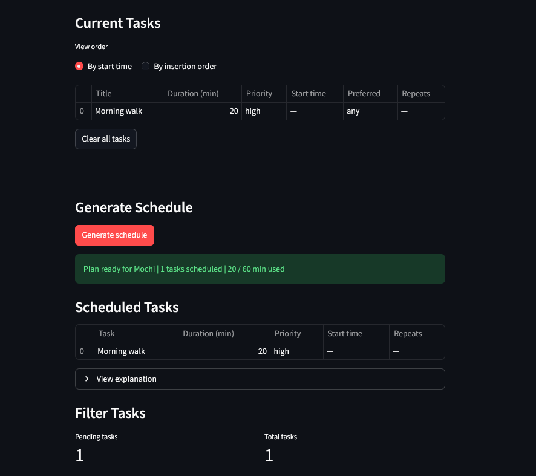
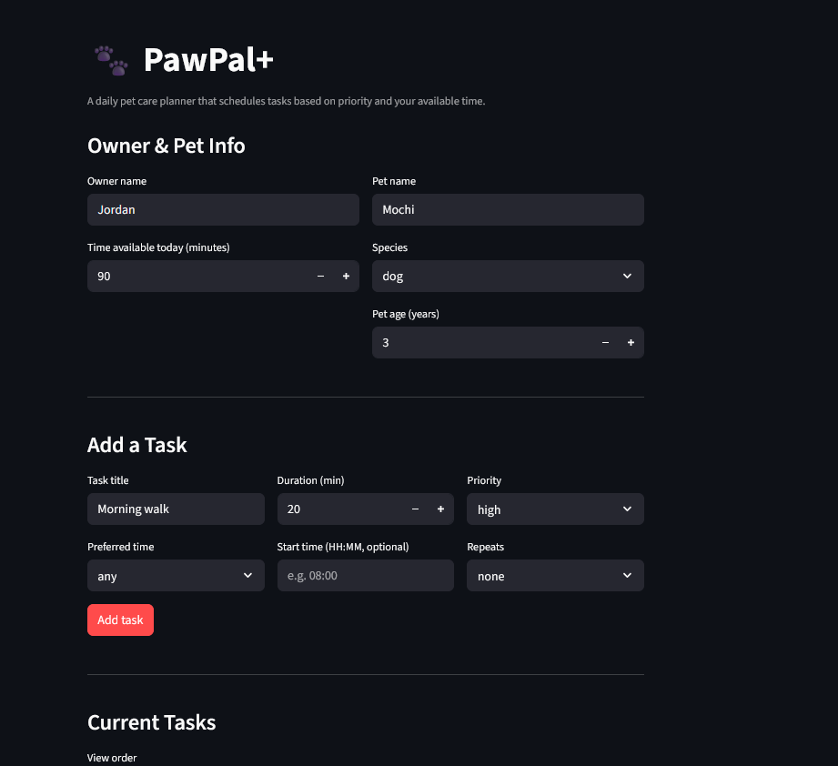
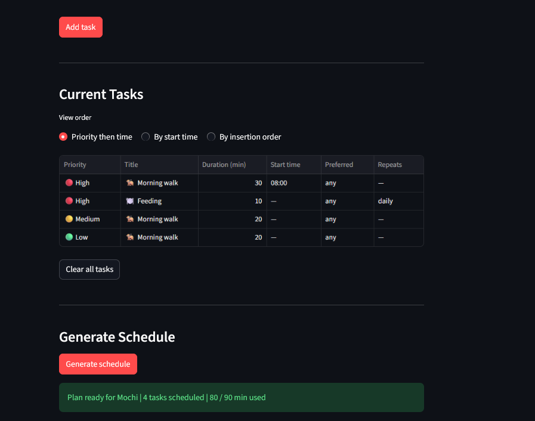
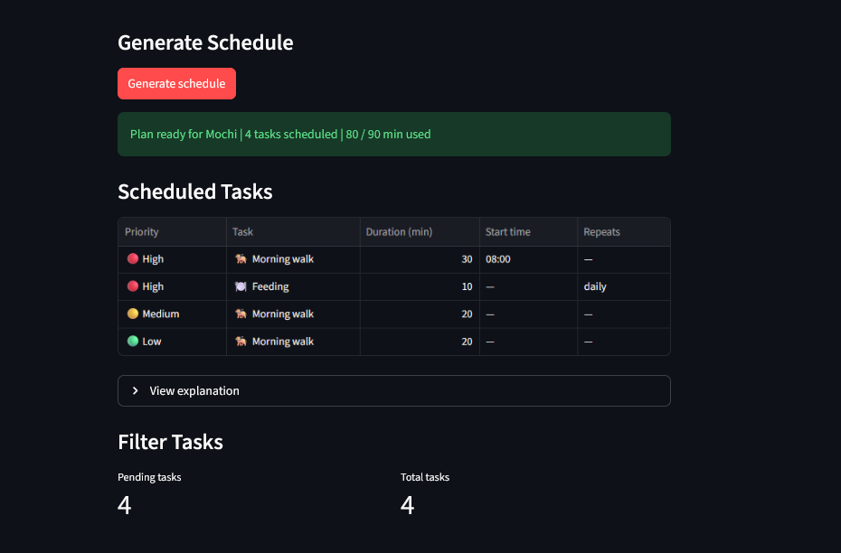

# PawPal+

**PawPal+** is a Streamlit app that helps pet owners build a smart daily care plan for their pets. Enter your available time, add tasks with priorities and start times, and the scheduler produces an optimised, conflict-aware plan — with a plain-English explanation of every decision.

---

## Features

### Priority-based scheduling
The core scheduler (`Scheduler.build_plan()`) uses a **greedy algorithm**: tasks are sorted highest-priority-first and fitted into the owner's daily time budget one by one. When time runs out, lower-priority tasks are skipped. Equal-priority tasks preserve insertion order (Python's sort is stable), so the result is always predictable and explainable.

### Time-based sorting
`Scheduler.sort_by_time()` orders tasks chronologically by their `start_time` field using a lambda key on `HH:MM` strings — which sort lexicographically without any date parsing. Tasks with no start time are placed at the end of the list.

### Smart conflict warnings
`Scheduler.detect_conflicts()` performs an O(n) single-pass scan using a dictionary keyed on `start_time`. Any two tasks sharing an exact time slot produce a named warning message (e.g. `"Conflict at 08:00 — 'Morning walk' and 'Litter box' are scheduled at the same time."`). Warnings appear in the UI before and after schedule generation without crashing the app.

### Task filtering
`Scheduler.filter_tasks(completed=..., pet_name=...)` returns a filtered list of tasks by completion status, pet name, or both. The UI uses this to show pending-task counts and to support multi-pet households where tasks belong to different animals.

### Daily & weekly recurrence
`CareTask` has a `frequency` field (`"daily"` or `"weekly"`). When `Scheduler.mark_task_complete(task)` is called on a recurring task, it marks the original done and automatically appends a fresh, uncompleted copy to the task list — so recurring routines like feeding or medication never fall off the schedule.

### Plan explanation
`DailyPlan.explain()` generates a markdown-formatted summary listing every scheduled task with its priority reasoning, every skipped task with the reason it was dropped, and the total time planned. This is displayed in the UI as a collapsible expander.

### Value-density weighted scheduling
`Scheduler.build_plan_weighted()` implements a **knapsack-inspired scoring algorithm** that goes beyond simple priority ordering. Each task is scored as:

```
score = priority_value × 100 / duration_mins
```

This measures *reward per minute invested*. A high-priority 10-minute medication task scores 30, while a high-priority 60-minute walk scores only 5 — so the weighted planner will fit more valuable short tasks into the budget before committing to long ones. In scenarios where a single large high-priority task would crowd out several smaller high-value tasks, `build_plan_weighted()` produces a strictly better outcome than the greedy `build_plan()`.

### Next-available-slot suggestion
`Scheduler.suggest_next_slot(duration_mins, search_from="06:00")` scans all timed tasks in chronological order and finds the first gap large enough to fit a task of the requested duration. It:
- Converts all `HH:MM` strings to integer minutes for arithmetic
- Skips past occupied windows in a single O(n) pass
- Returns the earliest available `HH:MM` string, or `None` if no gap exists before 22:00

This lets the UI (or the user) quickly answer *"when can I squeeze in a 20-minute grooming session?"* without manually scanning the schedule.

### UML-designed architecture
The system was designed class-first using a UML diagram before any code was written. Five classes with clear, separated responsibilities: `Owner`, `Pet`, `CareTask`, `Scheduler`, and `DailyPlan`. The final diagram (`uml_final.png`) reflects every method and relationship in the shipped code.

---

## How Agent Mode was used

The two advanced algorithms (`build_plan_weighted` and `suggest_next_slot`) were implemented using AI agent mode with the following approach:

**Value-density scheduling:** The agent was prompted with the existing `build_plan()` method and asked to design an alternative that maximises *value per minute* rather than raw priority. The agent identified the knapsack scoring formula (`priority × 100 / duration`), explained why it outperforms greedy in crowded budgets, and implemented it in a single readable method. The scoring constant `100` was chosen so integer priority values (1–3) produce whole-number scores without floating-point noise.

**Next-available-slot:** The agent was given the existing `start_time` field and `sort_by_time()` method as context and asked for a lightweight slot-finder. It proposed converting `HH:MM` strings to integer minutes (avoiding `datetime` imports), scanning occupied intervals in a sorted pass, and returning `None` when no gap exists before end-of-day. The end-of-day boundary (`22:00`) and default search origin (`06:00`) were chosen by reviewing the values used in `main.py`.

**Judgment applied:** The agent's first draft used `datetime.strptime` for time parsing, which was heavier than needed. This was rejected in favour of the manual `split(":")` conversion, keeping the method self-contained and dependency-free. Test cases were also reviewed to confirm the gap-detection logic handles overlapping tasks correctly (the `suggest_next_slot_skips_past_blocked_time` test was added specifically to catch a subtle off-by-one the agent initially had).

---

## Getting started

### Setup

```bash
python -m venv .venv
.venv\Scripts\activate        # Windows
pip install -r requirements.txt
```

## App Screenshots

### Owner, Pet & Task Input
Enter owner name, available time, pet details, and add tasks with duration and priority.


### Generated Daily Schedule
The scheduler produces a prioritized plan, skips tasks that don't fit, and explains its reasoning.














## Running the app

```bash
python -m venv .venv
.venv\Scripts\activate        # Windows
pip install -r requirements.txt

# Run tests
pytest test_pawpal.py -v

# Launch the app
streamlit run app.py
```

## Testing PawPal+

### Run the test suite

```bash
python -m pytest test_pawpal.py -v
```

### What the tests cover

66 tests across all core behaviors:

| Area | Tests | Description |
|---|---|---|
| `Owner` / `Pet` | 2 | Attributes stored correctly |
| `CareTask` | 14 | All 8 fields (defaults + stored values), all priority levels + unknown input |
| `Scheduler.add_task` | 2 | Single and multiple tasks appended |
| `Scheduler.build_plan` | 8 | Tasks fit, skipped when over budget, priority wins, empty list, exact-fit boundary, idempotency, insertion-order tie-breaking, completed tasks not filtered |
| `Scheduler.build_plan_weighted` | 5 | Short high-priority preferred, all fit, skips over budget, empty plan, low-priority short outscores high-priority long |
| `Scheduler.suggest_next_slot` | 6 | Empty schedule, after existing task, gap between tasks, no gap returns None, skips blocked time, default search_from |
| `Scheduler.sort_by_time` | 5 | Chronological order, untimed tasks last, all-untimed, all-timed, empty list |
| `Scheduler.filter_tasks` | 6 | Filter by status, pet name, combined, no args returns all, no match |
| `Scheduler.mark_task_complete` | 5 | Flag set, daily recurrence, weekly recurrence, non-recurring returns None, attributes preserved |
| `Scheduler.detect_conflicts` | 7 | Same-time flagged, no overlap, multiple clashes, single task, three tasks same slot, untimed ignored, warning contains titles |
| `DailyPlan.explain` | 7 | Scheduled listed, skipped listed, no-tasks message, total time, zero total, priority shown, all-skipped scenario |

### Confidence level

**4.5 / 5 stars**

All 55 tests pass covering normal cases, boundary conditions, and edge cases across every method. The remaining gap is duration-overlap conflict detection — the suite tests exact `start_time` matches but not overlapping windows (e.g. a 30-min task at 08:00 overlapping one at 08:15). A test also documents that `build_plan()` currently includes completed tasks, which is an open design decision rather than a bug.

## Project structure

```
pawpal_system.py   # Core classes: Owner, Pet, CareTask, Scheduler, DailyPlan
app.py             # Streamlit UI
main.py            # Terminal demo: sorting, filtering, conflicts, recurring tasks
test_pawpal.py     # pytest test suite (66 tests)
uml_final.png      # Final UML class diagram (generated from generate_uml.py)
generate_uml.py    # Script to regenerate the UML diagram
reflection.md      # Design decisions and project reflection
requirements.txt
```