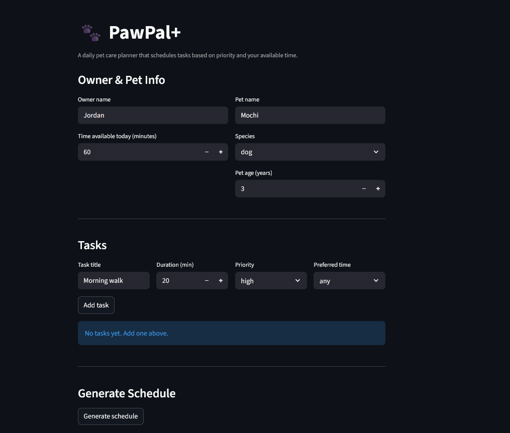
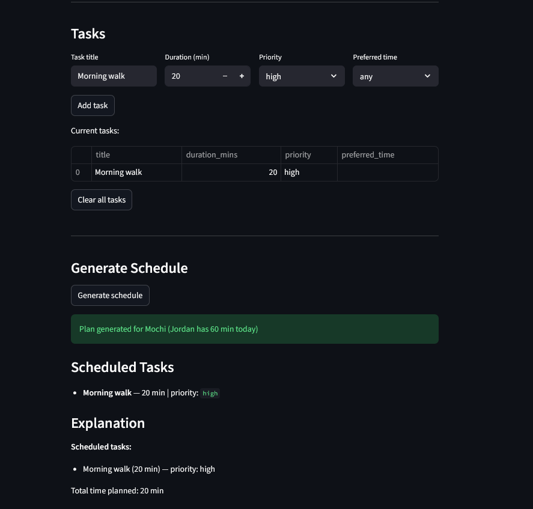

# PawPal+

**PawPal+** is a Streamlit app that helps pet owners build a smart daily care plan for their pets. Enter your available time, add tasks with priorities and start times, and the scheduler produces an optimised, conflict-aware plan — with a plain-English explanation of every decision.

---

## Features

### Priority-based scheduling
The core scheduler (`Scheduler.build_plan()`) uses a **greedy algorithm**: tasks are sorted highest-priority-first and fitted into the owner's daily time budget one by one. When time runs out, lower-priority tasks are skipped. Equal-priority tasks preserve insertion order (Python's sort is stable), so the result is always predictable and explainable.

### Time-based sorting
`Scheduler.sort_by_time()` orders tasks chronologically by their `start_time` field using a lambda key on `HH:MM` strings — which sort lexicographically without any date parsing. Tasks with no start time are placed at the end of the list.

### Smart conflict warnings
`Scheduler.detect_conflicts()` performs an O(n) single-pass scan using a dictionary keyed on `start_time`. Any two tasks sharing an exact time slot produce a named warning message (e.g. `"Conflict at 08:00 — 'Morning walk' and 'Litter box' are scheduled at the same time."`). Warnings appear in the UI before and after schedule generation without crashing the app.

### Task filtering
`Scheduler.filter_tasks(completed=..., pet_name=...)` returns a filtered list of tasks by completion status, pet name, or both. The UI uses this to show pending-task counts and to support multi-pet households where tasks belong to different animals.

### Daily & weekly recurrence
`CareTask` has a `frequency` field (`"daily"` or `"weekly"`). When `Scheduler.mark_task_complete(task)` is called on a recurring task, it marks the original done and automatically appends a fresh, uncompleted copy to the task list — so recurring routines like feeding or medication never fall off the schedule.

### Plan explanation
`DailyPlan.explain()` generates a markdown-formatted summary listing every scheduled task with its priority reasoning, every skipped task with the reason it was dropped, and the total time planned. This is displayed in the UI as a collapsible expander.

### UML-designed architecture
The system was designed class-first using a UML diagram before any code was written. Five classes with clear, separated responsibilities: `Owner`, `Pet`, `CareTask`, `Scheduler`, and `DailyPlan`. The final diagram (`uml_final.png`) reflects every method and relationship in the shipped code.

---

## Getting started

### Setup

```bash
python -m venv .venv
.venv\Scripts\activate        # Windows
pip install -r requirements.txt
```

## App Screenshots

### Owner, Pet & Task Input
Enter owner name, available time, pet details, and add tasks with duration and priority.



### Generated Daily Schedule
The scheduler produces a prioritized plan, skips tasks that don't fit, and explains its reasoning.



## Running the app

```bash
python -m venv .venv
.venv\Scripts\activate        # Windows
pip install -r requirements.txt

# Run tests
pytest test_pawpal.py -v

# Launch the app
streamlit run app.py
```

## Testing PawPal+

### Run the test suite

```bash
python -m pytest test_pawpal.py -v
```

### What the tests cover

44 tests across all core behaviors:

| Area | Tests | Description |
|---|---|---|
| `Owner` / `Pet` | 2 | Attributes stored correctly |
| `CareTask` | 6 | Priority values (all levels + unknown), `preferred_time` default and stored |
| `Scheduler.add_task` | 2 | Single and multiple tasks appended |
| `Scheduler.build_plan` | 7 | Tasks fit, skipped when over budget, priority wins, empty list, exact-fit boundary, idempotency, insertion-order tie-breaking |
| `Scheduler.sort_by_time` | 4 | Chronological order, untimed tasks last, all-untimed, empty list |
| `Scheduler.filter_tasks` | 5 | Filter by status, pet name, combined, no match |
| `Scheduler.mark_task_complete` | 5 | Flag set, daily recurrence, weekly recurrence, non-recurring returns None, attributes preserved |
| `Scheduler.detect_conflicts` | 5 | Same-time flagged, no overlap, multiple clashes, untimed ignored, warning contains titles |
| `DailyPlan.explain` | 7 | Scheduled listed, skipped listed, no-tasks message, total time, zero total, priority shown, all-skipped scenario |

### Confidence level

**4.5 / 5 stars**

All 44 tests pass and cover normal cases, boundary conditions, and edge cases across every method. The main gap is duration-overlap conflict detection — the current suite only tests exact `start_time` matches, not overlapping time windows (e.g. a 30-min task at 08:00 overlapping a task at 08:15). That feature is not yet implemented, so there is nothing to test yet.

## Project structure

```
pawpal_system.py   # Core classes: Owner, Pet, CareTask, Scheduler, DailyPlan
app.py             # Streamlit UI
main.py            # Terminal demo: sorting, filtering, conflicts, recurring tasks
test_pawpal.py     # pytest test suite (44 tests)
uml_final.png      # Final UML class diagram (generated from generate_uml.py)
generate_uml.py    # Script to regenerate the UML diagram
reflection.md      # Design decisions and project reflection
requirements.txt
```